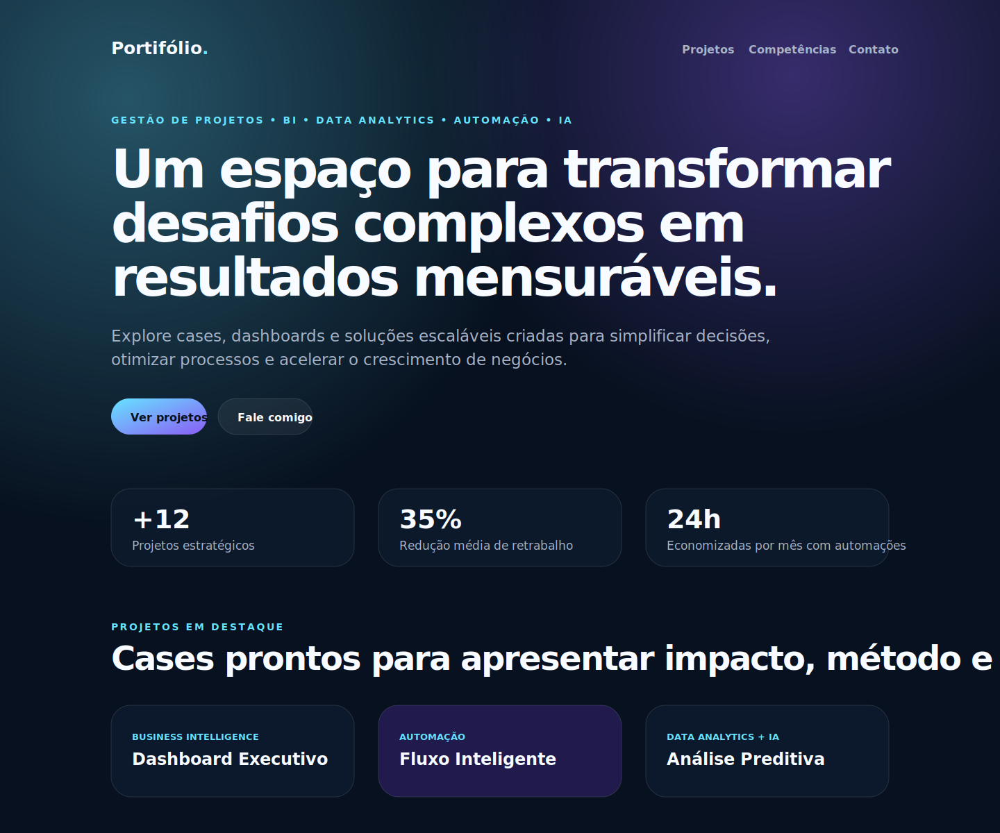

# Portif-rio_

Portfólio web em português com estética **black dark**, foco em UX sênior, storytelling de projetos, dados, automação e inteligência artificial. O projeto está pronto para rodar localmente e para deploy em hospedagens como a **Railway**.

## Rodando localmente

```bash
npm start
```

O servidor Node sem dependências externas usa a porta definida em `PORT` ou `3000` por padrão e escuta em `0.0.0.0`, que é o host esperado por plataformas como a Railway. Depois de iniciar, acesse `http://localhost:3000`.

## Deploy na Railway

O repositório inclui `package.json`, `server.js` e `railway.json`. Na Railway, basta criar um serviço a partir deste repositório; o Nixpacks detecta o projeto Node e executa:

```bash
npm start
```

A aplicação responde usando a variável `PORT` fornecida automaticamente pela Railway e faz bind em `0.0.0.0` para aceitar tráfego externo. Depois do deploy, acesse a URL pública gerada pela Railway para visualizar todo o front. O endpoint `/health` retorna o status do serviço para conferência rápida.

### Se aparecer "Unexposed service" na Railway

O deploy pode estar **successful** e ainda assim não mostrar o site se o serviço não tiver domínio público. Para publicar a URL:

1. Abra o serviço `Portif-rio_` na Railway.
2. Entre em **Settings**.
3. Vá até **Networking → Public Networking**.
4. Clique em **Generate Domain**.
5. Abra o domínio `*.up.railway.app` gerado pela Railway.

Isso expõe o serviço HTTP na internet e permite visualizar o front completo.

## Estrutura

- `index.html`: front completo do portfólio com hero, métricas, posicionamento, projetos, processo, competências e contato.
- `styles.css`: sistema visual responsivo black dark com gradientes, glassmorphism, grids, cards e microinterações.
- `server.js`: servidor HTTP Node nativo para servir os arquivos estáticos em produção.
- `railway.json`: configuração de build e start command para hospedagem na Railway.
- `nixpacks.toml`: instrução explícita para a Railway/Nixpacks iniciar o site sem instalar dependências.
- `assets/portfolio-preview.svg`: prévia visual versionada para ambientes sem suporte a screenshots por navegador.
- `scripts/create-preview.js`: utilitário sem dependências para gerar uma cópia de conferência da prévia.

## Prévia visual



A prévia fica versionada no repositório para evitar dependência de downloads externos durante a validação visual. Se o ambiente bloquear npm, apt ou pip com `403 Forbidden`, ainda é possível revisar o layout abrindo `index.html` no navegador ou visualizando o SVG em `assets/portfolio-preview.svg`.

Para regenerar a cópia de conferência da prévia sem instalar pacotes, execute:

```bash
node scripts/create-preview.js
```
